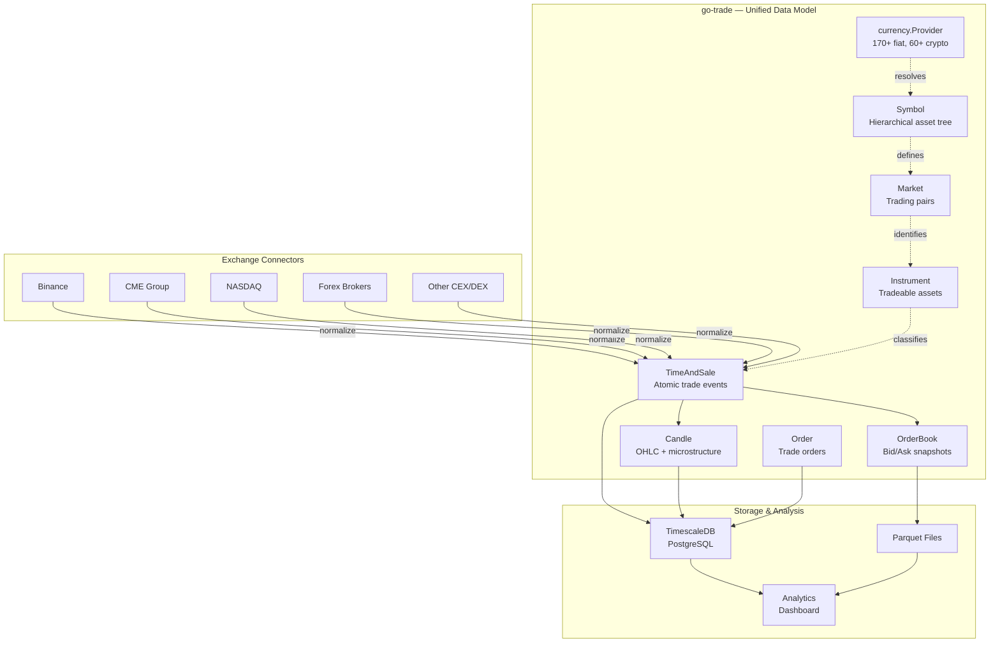
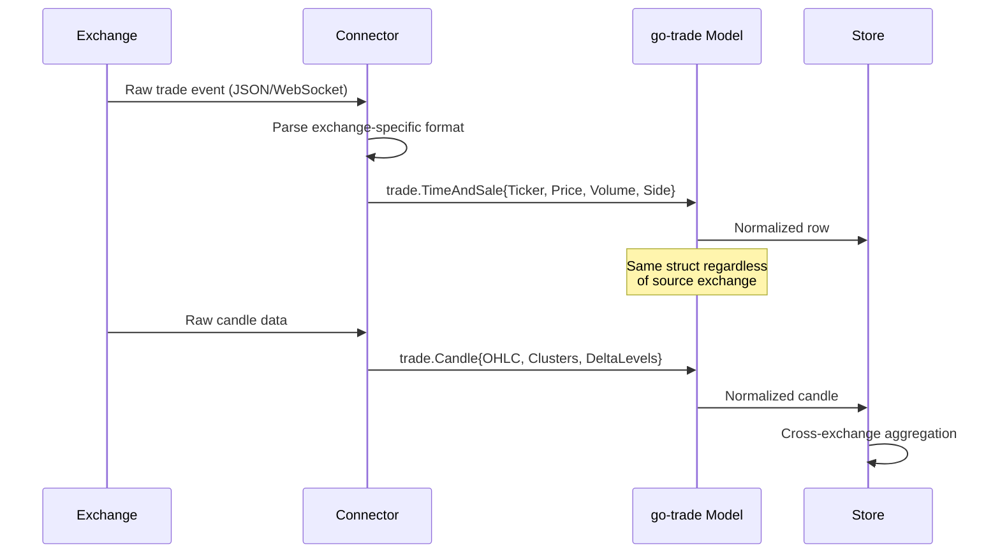
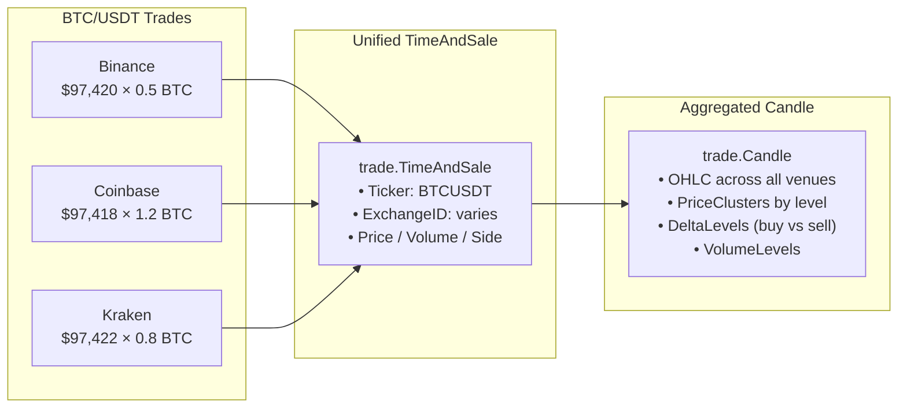
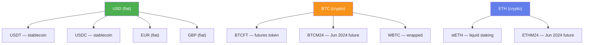

# go-trade

[](https://github.com/eSlider/go-trade/actions/workflows/ci.yml)
[](https://pkg.go.dev/github.com/eslider/go-trade)
[](https://opensource.org/licenses/MIT)
[](https://go.dev)
[](https://github.com/eSlider/go-trade/releases)
[](https://github.com/eSlider/go-trade/stargazers)

Go library providing a **unified data model for aggregating market data across multiple exchanges**. Defines exchange-agnostic types for candles, time-and-sale transactions, order books, orders, instruments, symbols, and currencies — serving as the common schema for normalizing data from Binance, CME, NASDAQ, and other trading venues.

## Architecture



## Data Flow



## Cross-Exchange Aggregation



## Symbol Hierarchy

Symbols form a tree that links base assets to their derivatives and stablecoins, enabling cross-exchange normalization:



## Installation

```bash
go get github.com/eslider/go-trade
```

## Features

- **Candle model** — OHLC + ask/bid, price clusters, delta/volume levels, price snake
- **TimeAndSale** — Atomic trade events with exchange ID, data feed provider, aggressor side
- **OrderBook** — Bid/ask snapshots with timestamps
- **Order** — Custom JSON unmarshaling for string-encoded fields from exchange APIs
- **Symbol** — Hierarchical asset tree (fiat/crypto) with parent-child relationships for derivatives
- **Instrument / Market** — Asset classification (spot, future, option, FX) and trading pairs
- **Currency provider** — Embedded 170+ fiat currencies and 60+ crypto tokens with lookup and filtering
- **DateTime / UUID** — JSON-aware wrappers for exchange date formats and UUIDs

## Quick Start

### Candle Analysis

```go
candle := trade.Candle{
    Open: 100.0, High: 110.0, Low: 95.0, Close: 108.0,
    Ask: 108.5, Bid: 107.5,
    TimeOpen:  time.Now().Add(-5 * time.Minute),
    TimeClose: time.Now(),
}

fmt.Println("Bullish:", candle.IsBullish())   // true
fmt.Println("Range:", candle.Range())          // 15.0
fmt.Println("Spread:", candle.Spread())        // 1.0
fmt.Println("Duration:", candle.Duration())    // 5m0s
```

### Time & Sale Recording

```go
event := trade.TimeAndSale{
    Ticker:     "BTCUSDT",
    ExchangeID: 1,  // Binance
    Time:       time.Now(),
    Sale: trade.Sale{
        Price:         97420.50,
        AggressorSide: trade.AggressorBuy,
        Volume:        5,
    },
}
fmt.Printf("%s: %s @ $%.2f (%s)\n",
    event.Ticker, event.Sale.AggressorSide,
    event.Sale.Price, event.Time.Format(time.RFC3339))
```

### Currency Lookup

```go
import "github.com/eslider/go-trade/currency"

provider, _ := currency.New()

btc := provider.Currencies.Get("BTC")
fmt.Println(btc.Description) // "Bitcoin"
fmt.Println(btc.IsCrypto())  // true

fiats := provider.Currencies.Fiats()
fmt.Printf("%d fiat currencies loaded\n", len(fiats))

cryptos := provider.Currencies.Cryptos()
fmt.Printf("%d cryptocurrencies loaded\n", len(cryptos))
```

### Symbol Tree

```go
symbols := trade.Symbols{
    {ID: 1, Type: trade.SymbolFiat, Code: "USD", Name: "US Dollar"},
    {ID: 2, Type: trade.SymbolCrypto, ParentID: 1, Code: "USDT", Name: "Tether"},
    {ID: 3, Type: trade.SymbolCrypto, ParentID: 1, Code: "USDC", Name: "USD Coin"},
    {ID: 14, Type: trade.SymbolCrypto, Code: "BTC", Name: "Bitcoin"},
    {ID: 22, Type: trade.SymbolCrypto, ParentID: 14, Code: "BTCFT", Name: "BTC Futures Token"},
}

// Tree navigation
roots := symbols.Roots()               // USD, BTC
btcDerivs := symbols.Children(14)      // BTCFT
usdStables := symbols.Children(1)      // USDT, USDC

// Lookup
btc := symbols.GetByCode("BTC")
fmt.Println(btc.IsCrypto(), btc.IsRoot()) // true true

// Filter
fiats := symbols.Fiats()               // USD
cryptos := symbols.Cryptos()            // USDT, USDC, BTC, BTCFT
```

### Order Deserialization

```go
// Exchange APIs often return numeric fields as strings
raw := []byte(`{
    "order_id": "b68d69564a79dea4776afa33d1d2fcab",
    "customer_id": "41",
    "order_status": "shipped",
    "order_approved_at": "2018-02-28 10:40:35"
}`)

var order trade.Order
json.Unmarshal(raw, &order)
fmt.Println(order.OrderID)    // b68d6956-4a79-dea4-776a-fa33d1d2fcab
fmt.Println(order.CustomerID) // 41 (int64, not string)
```

## Package Structure

```
go-trade/
├── trade.go               # Package doc
├── candle.go              # Candle (OHLC + microstructure)
├── time_and_sale.go       # Atomic trade events
├── order.go               # Trading orders
├── instrument.go          # Instruments and markets
├── symbol.go              # Hierarchical asset symbols
├── aggressor_side.go      # Buy/sell side enum
├── datetime.go            # Exchange datetime parser
├── uuid.go                # UUID JSON wrapper
├── price_clusters.go      # Volume at price level
├── candle_delta_levels.go # Delta/volume levels
├── trade_test.go          # Unit tests
├── symbol_test.go         # Symbol tests
└── currency/
    ├── currency.go        # Fiat + crypto provider
    ├── currency_test.go   # Currency tests
    └── currencies.yml     # 170+ fiat, 60+ crypto definitions
```

## API Reference

### Core Types

| Type | Description |
|---|---|
| `Candle` | OHLC candlestick with price clusters, delta levels, and volume profile |
| `TimeAndSale` | Atomic trade event: price, volume, side, exchange, timestamp |
| `Order` | Trading order with auto-deserialization from string-encoded JSON |
| `Symbol` | Trading symbol with type (fiat/crypto) and parent-child hierarchy |
| `Symbols` | Collection with `GetByCode`, `GetByID`, `Children`, `Roots`, `Fiats`, `Cryptos` |
| `SymbolType` | Enum: `SymbolFiat`, `SymbolCrypto` |
| `Instrument` | Tradeable asset (spot, future, option, FX) |
| `Market` | Trading pair (FROM/TO symbols) |
| `OrderBook` / `OrderBookEntry` | Bid/ask snapshot at a point in time |
| `Sale` | Core trade data (price, aggressor side, volume) |
| `PriceClusters` | Volume and time distribution at a price level |
| `CandleDeltaLevels` | Min/max delta values within a candle |
| `DateTime` | JSON-compatible datetime for `"2006-01-02 15:04:05"` format |
| `UUID` | JSON-compatible UUID wrapper |

### Candle Methods

| Method | Description |
|---|---|
| `IsBullish()` | Close > Open |
| `IsBearish()` | Close < Open |
| `IsEmpty()` | No data |
| `Spread()` | Ask − Bid |
| `Range()` | High − Low |
| `Duration()` | TimeClose − TimeOpen |

### Symbol Methods

| Method | Description |
|---|---|
| `IsRoot()` | ParentID == 0 (top-level asset) |
| `IsFiat()` | Type == SymbolFiat |
| `IsCrypto()` | Type == SymbolCrypto |

### Symbols Collection

| Method | Description |
|---|---|
| `GetByCode(code)` | Find symbol by ticker code |
| `GetByID(id)` | Find symbol by numeric ID |
| `Children(parentID)` | All symbols with given parent |
| `Roots()` | All top-level symbols (parent == 0) |
| `Fiats()` | Filter fiat symbols |
| `Cryptos()` | Filter crypto symbols |

### Currency Package

| Function | Description |
|---|---|
| `currency.New()` | Load all embedded currency/unit data |
| `Currencies.Get(code)` | Lookup by code ("BTC", "USD") |
| `Currencies.Cryptos()` | Filter crypto only |
| `Currencies.Fiats()` | Filter fiat only |

## Environment

- **Go 1.22+**
- **CI**: GitHub Actions (Go 1.22, 1.23, 1.24) with race detection and golangci-lint

## Related

- [go-ollama](https://github.com/eSlider/go-ollama) — Ollama/Open WebUI API client
- [go-matrix-bot](https://github.com/eSlider/go-matrix-bot) — Matrix bot with AI integration
- [go-onlyoffice](https://github.com/eSlider/go-onlyoffice) — OnlyOffice Project Management API
- [go-gitea-helpers](https://github.com/eSlider/go-gitea-helpers) — Gitea pagination helpers

## License

[MIT](LICENSE)
